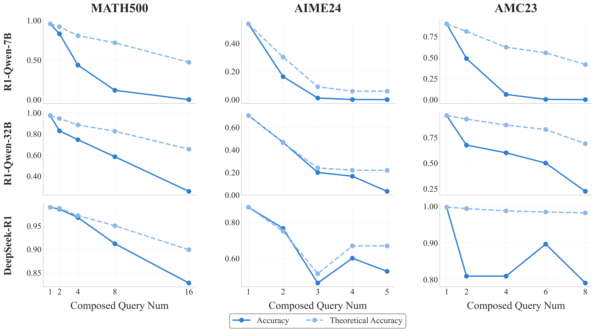
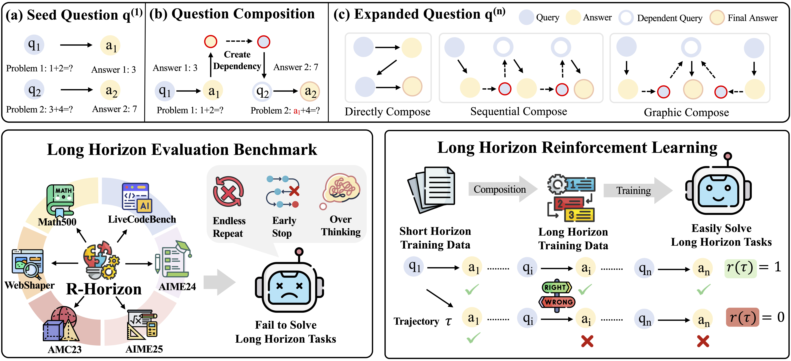

<div align="center">

<h1>
  
  R-HORIZON
</h1>

<div>
   How Far Can Your Large Reasoning Model Really Go in Breadth and Depth? 
</div>
</div>

<br>


<p align="center">
  📃 <a href="https://arxiv.org/abs/2510.08189" target="_blank">Paper</a > • 🌐 <a href="https://reasoning-horizon.github.io/" target="_blank">Project Page</a > • 🤗 <a href="https://huggingface.co/datasets/meituan-longcat/R-HORIZON-training-data" target="_blank">Dataset</a >
</p >

R-HORIZON is a novel method designed to stimulate long-horizon reasoning behaviors in Large Reasoning Models (LRMs) through query composition. We transform isolated problems into complex multi-step reasoning scenarios, revealing that even the most advanced LRMs suffer significant performance degradation when facing interdependent problems that span long reasoning horizons.



## 🔥 Releases

**[2025-10-09]**
- 🎉 **R-HORIZON Benchmark** is now available! Test your LRMs on complex multi-horizon reasoning tasks.
- 🤗 **Training and evaluation datasets** are available on Hugging Face: [R-HORIZON Dataset](https://huggingface.co/datasets/meituan-longcat/R-HORIZON-training-data)
- 📄 **Paper released** on arXiv: [R-HORIZON: How Far Can Your Large Reasoning Model Really Go in Breadth and Depth?](https://arxiv.org/abs/2510.08189)


## 🌟 Overview

Recent advances in reasoning-focused language models (e.g., OpenAI o1, DeepSeek-R1) have demonstrated remarkable improvements through test-time scaling and long Chain-of-Thought (CoT). However, existing benchmarks primarily focus on immediate, single-horizon tasks, failing to adequately evaluate models' ability to handle complex, long-horizon scenarios.

**Key challenges in current paradigms:**
- **Limited evaluation scope**: Existing benchmarks confine themselves to isolated problems, missing the complexity of real-world multi-step reasoning
- **Limited effective reasoning length**: Models struggle to maintain performance as reasoning chains grow longer
- **Poor thinking budget allocation**: LRMs fail to appropriately distribute thinking resources across multiple interdependent problems

To address these limitations, we introduce **R-HORIZON**, which:
- Transforms isolated problems into **complex multi-step reasoning scenarios** through query composition
- Establishes the **R-HORIZON Benchmark** comprising 6 representative datasets from mathematics, code generation, and agent applications
- Enables **reinforcement learning with verified rewards (RLVR)** using long-horizon reasoning data



## 📖 Table of Contents

- [🔥 Releases](#-releases)
- [🌟 Overview](#-overview)
- [📊 R-HORIZON Benchmark](#-r-horizon-benchmark)
- [🚀 Training with R-HORIZON](#-training-with-r-horizon)
- [Quick Start](#quick-start)
  - [Installation](#installation)
  - [Benchmark Evaluation](#benchmark-evaluation)
  - [Training with R-HORIZON datasets](#training-with-r-horizon-datasets)
- [Dataset](#dataset)
  - [Dataset Construction](#dataset-construction)
  - [Dataset on Hugging Face Hub](#dataset-on-hugging-face-hub)
  - [Dataset Structure](#dataset-structure)
- [Citation](#citation)

## 📊 R-HORIZON Benchmark

We evaluate 20+ state-of-the-art LRMs on the R-HORIZON Benchmark, revealing significant performance degradation as reasoning horizons increase:


**Key findings from our benchmark evaluation:**

- **Universal performance degradation**: Even the most powerful models suffer severe drops as problem count increases. For instance, DeepSeek-R1 drops from 87.3% (single problem) to 24.6% (5 problems) on AIME25.

- **Model size matters**: Larger models exhibit more resilience to multi-horizon challenges. R1-Qwen-7B drops from 93.6% to 0% when solving 16 problems, showing 34.1% more degradation than the 32B models.

- **Task-dependent degradation**: Code generation tasks show steeper performance declines compared to mathematics. Many reasoning models lose their tool-calling abilities in web search scenarios, resulting in poor multi-step performance.

## 🚀 Training with R-HORIZON

Training with R-HORIZON composed data yields substantial improvements on both single and multi-horizon reasoning tasks:


**Training results highlights:**

- **Dual Performance Gains**: Training with 2-composed problems significantly improves both multi-horizon reasoning (+17.4 points on AIME24 n=2) and single-problem performance (+7.5 points on AIME24 original).

- **Scalable Complexity**: Increasing composition complexity (n=4) enhances the model's ability to handle problems requiring more reasoning steps, achieving 50.6% on Math500 (n=8).

| Models | MATH500 (Origin) | MATH500 (n=8) | AIME24 (Origin) | AIME24 (n=2) | AIME25 (Origin) | AIME25 (n=2) | AMC23 (Origin) | AMC23 (n=2) |
|-----------------|------------------|---------------|-----------------|--------------|-----------------|--------------|----------------|-------------|
| R1-Qwen-7B | 93.6 | 11.8 | 48.3 | 16.4 | 33.3 | 3.5 | 90.2 | 48.8 |
| Baseline (n=1) | **95.6** | 8.4 | 57.9 | 16.7 | 47.9 | 5.1 | **95.9** | 55.0 |
| R-HORIZON (n=2) | 95.4 | 21.4 | **65.4** | 34.1 | **49.6** | **10.0** | 94.1 | **80.6** |
| R-HORIZON (n=4) | 94.6 | **50.6** | 62.9 | **34.8** | 45.4 | 8.1 | 91.9 | 79.1 |


## Quick Start

### Installation

```bash
# Clone the repository
git clone https://github.com/meituan-longcat/R-HORIZON.git
cd R-HORIZON

# Create conda environment
conda create -n r-horizon python=3.10 -y
conda activate r-horizon

# Install PyTorch
pip3 install torch==2.4.0 --index-url https://download.pytorch.org/whl/cu124
pip3 install flash-attn --no-build-isolation

# Install additional dependencies
pip install -r requirements.txt
```

### Benchmark Evaluation

1. Download the R-HORIZON Benchmark

```bash
# Download benchmark datasets
python ./evaluation/data/download.py
```

2. Modify config.json under evaluation directory
```json
{
    "inference": {
        // model_key (e.g. r1-distill-qwen7b) is for run.sh
        "r1-distill-qwen7b": {
            // the ip and port used in vllm server
            "base_url": "http://{Your IP and Port}/v1/completions",
            "api_key": "EMPTY",
            // model_name is corresponding to the modelname in vllm server
            "model_name": "{vllm's modelname}", 
            "params": {
                "temperature": 1.0,
                "top_p": 0.95,
                "top_k": 10,
                "max_tokens": 65536
            },
            "prompt_prefix": "<|im_start|>user:\n",
            "prompt_suffix": "\n<|im_end|>\n<|im_start|>assistant:\n"
        }
    },
    "extract": {
        "gpt-4.1": {
            "model_name": "gpt-4.1",
            "base_url": "{OpenAI's baseurl}",
            "api_key": "{Your API key}",
            "params": {
                "temperature": 0.0,
                "max_tokens": 16000
            }
        }
    }
}
```

3. Run a vllm server
```bash
vllm serve {modelname}\
    --host {ip}\
    --port {port}\
    --served-model-name {modelname}\
    --dtype auto --pipeline-parallel-size 1 --tensor-parallel-size 1 --trust-remote-code\
    --enable-chunked-prefill --max-model-len 131072 --max-num-batched-tokens 10240\
    --max-num-seqs 256 --gpu-memory-utilization 0.85 --disable-custom-all-reduce\
    --enable-reasoning --reasoning-parser deepseek_r1 --enable-chunked-prefill
```

4. Evaluate your model 

Here is a bash example, and model_key is defined in config.json
```bash
sh evaluation/run.sh {input_file} {output_dir} {model_key}
# example
sh evaluation/run.sh evaluation/data/R-HORIZON-Math500/Math500-combined-n2.jsonl evaluation/result r1-distill-qwen7b
```

### Training with R-HORIZON datasets
1. Download composed training data

```python
from huggingface_hub import snapshot_download

snapshot_download(
    repo_id="meituan-longcat/R-HORIZON-training-data",
    repo_type="dataset",
    local_dir="./training/data",
)
```

2. Launch training

```bash
# Train with R-HORIZON using GRPO algorithm
bash ./training/scripts/train/skywork-or1-rlvr-math-training-7b-40k.sh
```


## Dataset
### Dataset Construction
Step 1: Filter Samples with Valid Integers  
```bash
# Purpose: Retain samples containing valid integers in input text and pure integer targets, excluding ambiguous numeric expressions (e.g., floats, fractions, LaTeX commands).  
python step1_filt_integer_samples.py
```

Step 2: Identify Key Variables
```bash
# Purpose: select "key variables" (critical integers that significantly affect problem outcomes)
# configure API credentials in the script (replace YOUR_API_KEY)
python step2_select_key_variable.py
```

Step 3: Combine into Chained Reasoning Problems
```bash
# Purpose: Generate multi-horizon chained problems where each step's key variable depends on the previous step's answer.
python step3_combine_problems.py
```

### Dataset on Hugging Face Hub
The R-HORIZON training datasets and evaluation benchmark are available on Hugging Face Hub:

| Dataset Type | Dataset Name                  | Hugging Face Link                                                                 |
|--------------|-------------------------------|-----------------------------------------------------------------------------------|
| Evaluation   | R-HORIZON-Math500             | [link](https://huggingface.co/datasets/meituan-longcat/R-HORIZON-Math500)             |
| Evaluation   | R-HORIZON-AIME24              | [link](https://huggingface.co/datasets/meituan-longcat/R-HORIZON-AIME24)               |
| Evaluation   | R-HORIZON-AIME25              | [link](https://huggingface.co/datasets/meituan-longcat/R-HORIZON-AIME25)               |
| Evaluation   | R-HORIZON-AMC23               | [link](https://huggingface.co/datasets/meituan-longcat/R-HORIZON-AMC23)               |
| Evaluation   | R-HORIZON-Websearch           | [link](https://huggingface.co/datasets/meituan-longcat/R-HORIZON-Websearch)            |
| Training     | R-HORIZON-training-data       | [link](https://huggingface.co/datasets/meituan-longcat/R-HORIZON-training-data)        |


### Dataset Structure

```json
{
  "input": "[1-N linked problems + solving instructions (with [variablek]/[answerk] placeholders)]",
  "instanceId": "[Unique ID for this instance]",
  "origin_instanceIds": "[List of original problem IDs]",
  "target": "[List of final answers, e.g., [answer1, answer2]]",
  "num_problems": "[Total problems, e.g., 2]",
  "selected_variables": [
    {
      "number": "[Key variable from problem]",
      "context": "[Context of the number]",
      "text": "[Text of the number]",
      "is_independent": "[true/false]",
      "is_in_math_env": "[true/false]"
    }
  ]
}
```

## Citation
If you find R-HORIZON helpful for your research, please cite our paper:

```bibtex
@misc{lu2025rhorizonfarlargereasoning,
      title={R-Horizon: How Far Can Your Large Reasoning Model Really Go in Breadth and Depth?}, 
      author={Yi Lu and Jianing Wang and Linsen Guo and Wei He and Hongyin Tang and Tao Gui and Xuanjing Huang and Xuezhi Cao and Wei Wang and Xunliang Cai},
      year={2025},
      eprint={2510.08189},
      archivePrefix={arXiv},
      primaryClass={cs.AI},
      url={https://arxiv.org/abs/2510.08189}, 
}
```
